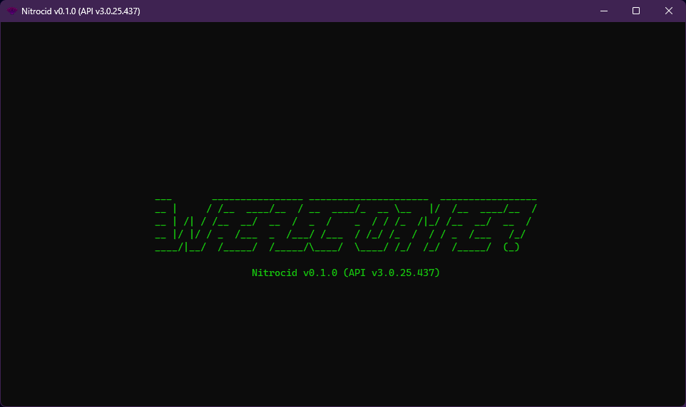
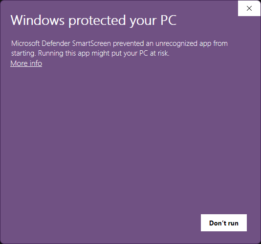

# Windows

<figure><figcaption></figcaption></figure>

Installing Nitrocid KS on Windows is pretty easy, but we recommend installing the simulator using the Chocolatey package manager.


Extra kernel add-ons may require additional hardware on your computer to work. For example, the BassBoom addon requires that you have audio drivers installed on your computer.


Before performing the installation, your Windows system must meet the following requirements:

### KS v0.1.0 or later

To run Nitrocid KS in the absolute minimum requirements, your computer needs to have the following installed:

| System     | Framework                                                          | Terminal                                                  |
| ---------- | ------------------------------------------------------------------ | --------------------------------------------------------- |
| Windows 7+ | [.NET 8.0](https://dotnet.microsoft.com/en-us/download/dotnet/8.0) | [ConEmu](https://conemu.github.io/) or Windows 10 cmd.exe |

However, we recommend that you have the below software installed on your computer to get the best out of the kernel:

| System      | Framework                                                          | Terminal           |
| ----------- | ------------------------------------------------------------------ | ------------------ |
| Windows 10+ | [.NET 8.0](https://dotnet.microsoft.com/en-us/download/dotnet/8.0) | Windows 10 cmd.exe |

## Installation

There are several ways to install Nitrocid KS on Windows systems. We recommend installing KS using the Chocolatey package manager for simplicity.

### Method 1: Chocolatey

This step-by-step guide shows you how to install Nitrocid KS using the package manager, [Chocolatey](https://chocolatey.org/install), assuming that you already have it on your system.

1. Ensure that Chocolatey is installed to your system PATH
2. Open your favorite terminal emulator, like ConEmu, and execute the following command: `choco install ks`
3. Start Nitrocid KS using `ks`

### Method 2: Manual unpack

If you like to manually unpack the Nitrocid KS packages, follow these steps:

1. Ensure that you have all the required software installed
2. Download the latest release ZIP file from [this page](https://github.com/Aptivi/Kernel-Simulator/releases).
3. Unpack the ZIP archive to any folder of your choice using [7-Zip](https://7-zip.org/)
4. Open your favorite terminal emulator, like ConEmu, and change the working directory to a folder containing the Nitrocid KS executable
5. Execute `ks` or `Nitrocid.exe` to start the kernel

## Notice for SmartScreen

SmartScreen may detect that the Nitrocid and its associated executables may not pass the SmartScreen attestation. If this happens, you'll see the below page:

<figure><figcaption></figcaption></figure>

Nitrocid KS will not put your PC at risk (except if you downloaded a copy from an unofficial software distributor, or from an unofficial source other than our official releases, our Chocolatey page found [here](https://community.chocolatey.org/packages/KS), and our NuGet page found [here](https://www.nuget.org/packages/KS/)). Click on `More Info`, then click on `Run anyways`.
